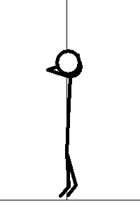
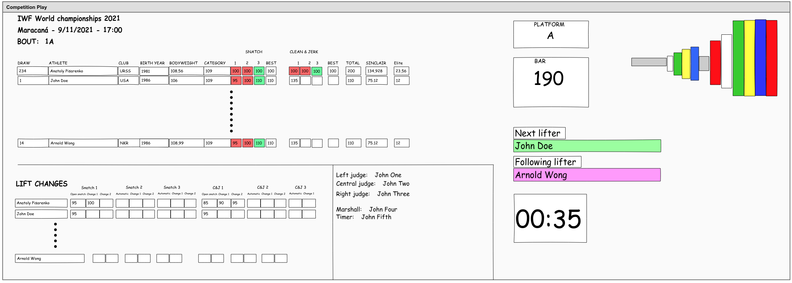
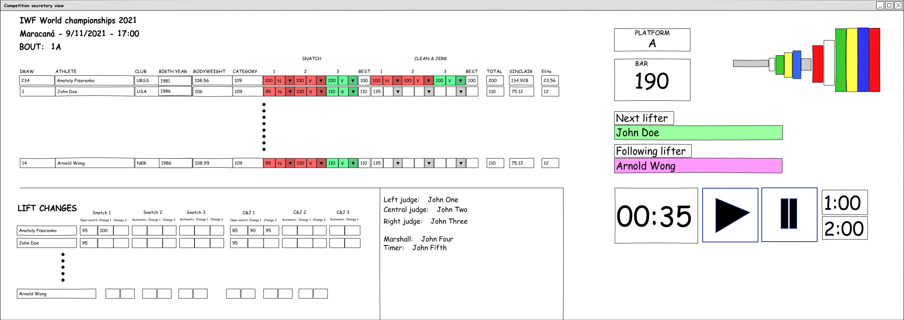
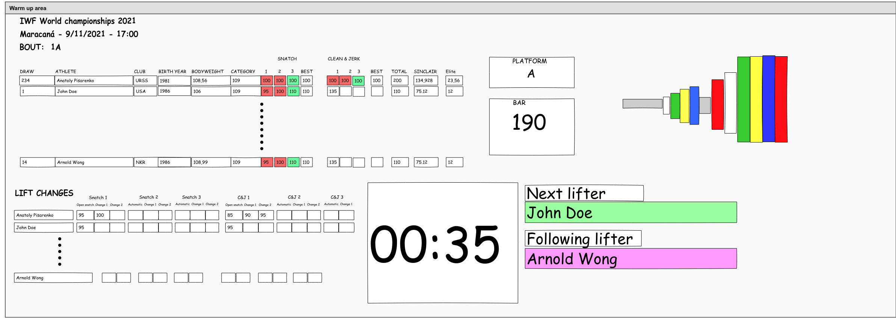
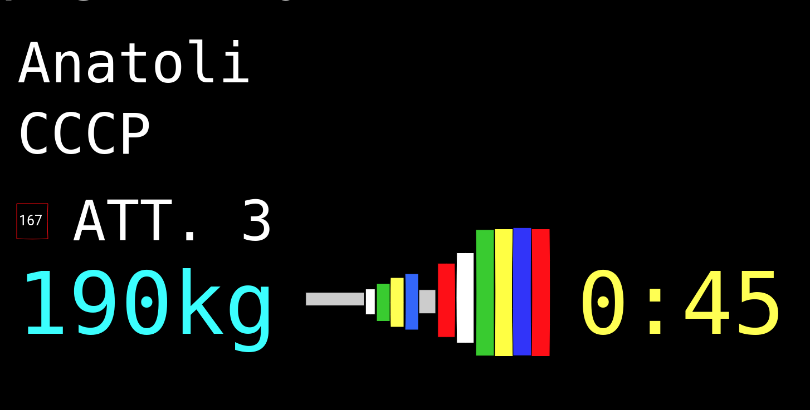
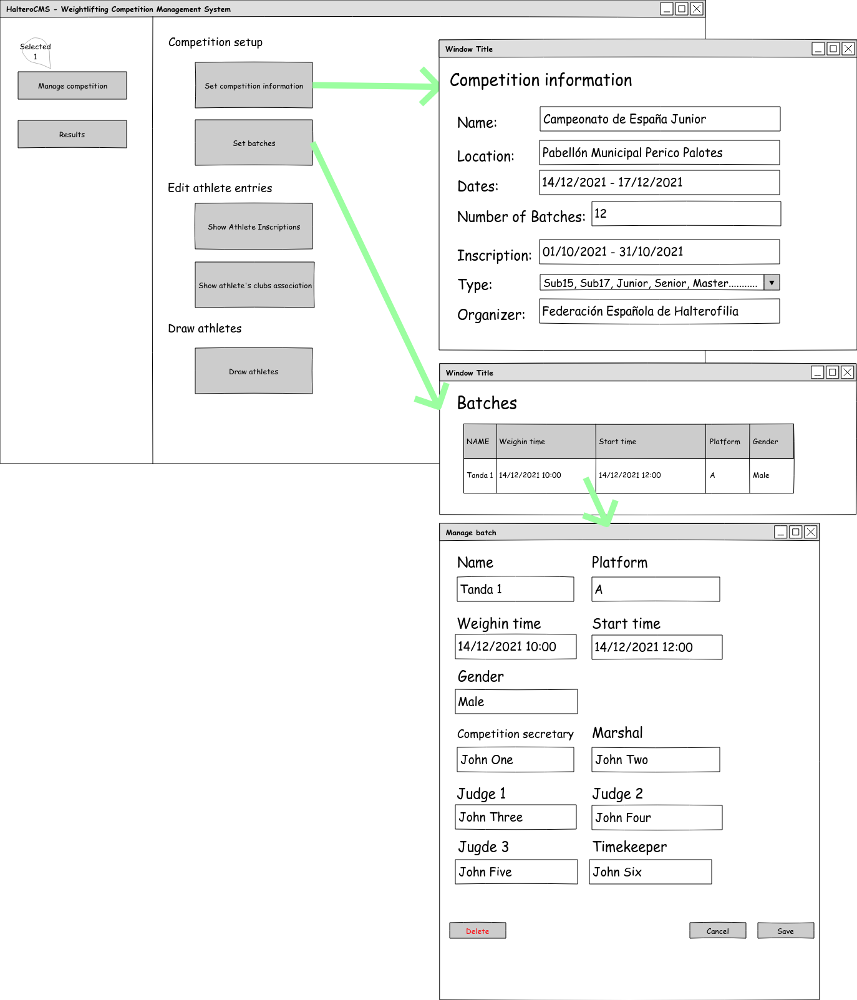

# mastercloud_pfm_halterocms

# Índice
1. [Introducción](#intro)

    1.1 [Objetivos](#goals)

    1.2 [Halterofilia](#intro_haltero)

2. [Modelo del dominio](#domainModel)
3. [Disciplina de requisitos](#requirements)

    3.1 [Actores y casos de uso](#actors)

    3.2 [Especificación de casos de uso](#useCases)

    3.3 [Prototipado interfaz de usuario](#prototype)
        
5. [Disciplina de análisis](#analisis)
7. [Disciplina de diseño](#design)
8. [Disciplina de implementación](#implementation)
9. [Disciplina de pruebas](#tests)

10. [Conclusiones](#conclusions)
11. [Autores](#authors)
12. [Bibliografía](#biblio)

## 1. Introducción<a name="intro"/>

El objetivo principal de este proyecto es el desarrollo de una aplicación para la creación y gestión integral de una competición de halterofilia, según la normativa de la Federación Española de Halterofilia (FEH), dirigido mediante el proceso de desarrollo RUP.

### 1.1 Objetivos<a name="goals"/>

El objetivo principal del proyecto es el desarrollo de una aplicación web para la gestión integral de una competición de halterofilia. Para llevar a cabo este proyecto se va a utilizar el proceso unificado de desarrollo  Rational Unified Process (RUP)

Los subojetivos del proyecto son:
* Profundizar en el proceso de desarrollo RUP aplicado a un proyecto real.
* Realizar un proyecto focalizado en:  
    * Afianzar el correcto análisis y diseño
    * Aplicación correcta de diversos patrones
* Aplicación de un modelo de desarrollo basado en *Gitflow*
* Implementar un entorno de integración y despliegue continuos mediante el uso de:
    * Git como gestor de versiones
    * Github como repositorio (tanto de código como de artefactos)
    * Github project como administrador/organizador de tareas
    * Github Actions como herramienta de integración continua
* Despliegue de una aplicación en la nube mediante el proveedor AWS/Heroku *(!! TO BE DECIDED )*

### 1.2 ¿Qué es la halterofilia? <a name="intro_haltero"/>
La halterofilia es un deporte que consiste en el levantamiento del máximo peso posible de una barra a cuyos extremos se fijan varios discos de distinto peso.
Existen dos modalidades de competición *arrancada(snatch)* y *dos tiempos(clean&jerk)*

Se divide en categoría masculina y femenina. A su vez, ambas se subdividen en distintas categorías de acuerdo a la masa corporal y edad del atleta.

Más información

[Vídeo 1](https://www.youtube.com/watch?v=-zJeDy-gBr4)

[Vídeo_2](https://www.youtube.com/watch?v=l8oxCtwQdm0)

[Vídeo_3](https://www.youtube.com/watch?v=UcWjOqbZuo0&t=144s)

## 2. Modelo de dominio <a name="domainModel"/>
[Modelo del dominio](diagrams/modelDomain/competitionDomainModel.puml)

## 3. Disciplina de requisitos <a name="requirements"/>
### 3.1 Actores y casos de uso <a name="actors"/>
### 3.2 Especificación de casos de uso <a name="useCases"/>
### 3.3 Prototipado interfaz de usuario <a name="prototype"/>

#### Vista de espectador

#### Vista de secretario de competición

#### Vista de calentamiento

#### Vista de levantamiento

#### Vista de temporizador

#### Vista de organizador

## 4. Disciplina de análisis <a name="analisis"/>

## 5. Disciplina de diseño <a name="design"/>

## 6. Disciplina de implementación <a name="implementation"/>

## 7. Disciplina de pruebas <a name="tests"/>
 

## Conclusiones <a name="conclusions"/>
## Autores <a name="authors"/>

👤 **Natalia Roales**

👤 **Jaime Hernández** 

## Bibliografía <a name="biblio"/>

[1] Kanban proyecto [webpage online]. Available: https://github.com/zuldare/mastercloud_pfm_halterocms/projects/1

[1] Github actions [webpage online]. Available: https://github.com/features/actions

[1] PlantUml [webpage online]. Available: [https://plantuml.com/es/](https://plantuml.com/es/)

[1] Pencil [herramienta]. Available: [https://pencil.evolus.vn/](https://pencil.evolus.vn/)

-----------------------------------------------------------------
## Nivel de compromiso:

Jaime: yo hasta fin de año le puedo dedicar 3-4 horas diarias.

Natalia: entre 6 y 8 horas semanales.
