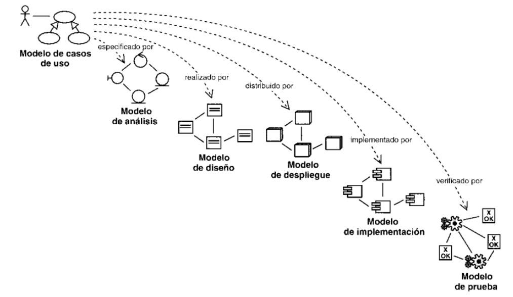
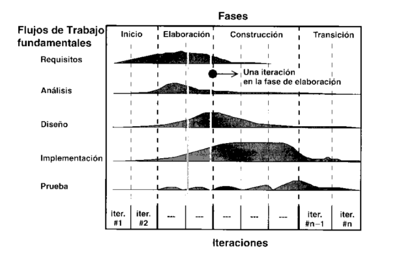

# mastercloud_pfm_halterocms

# Índice
1. [Introducción](#intro)

    1.1 [Objetivos](#goals)

    1.2 [Halterofilia](#intro_haltero)

2. [Proceso unificado de desarrollo (RUP)](#rup)

3. [Modelo del dominio](#domainModel)
4. [Disciplina de requisitos](#requirements)

    3.1 [Actores y casos de uso](#actors)

    3.2 [Especificación de casos de uso](#useCases)

    3.3 [Prototipado interfaz de usuario](#prototype)

[comment]: <> (Encontrar Actores y Casos de Uso)
[comment]: <> (Priorizar Casos de Uso)
[comment]: <> (Detallar Caso de Uso)
[comment]: <> (Estructurar Casos de Uso)
[comment]: <> (PrototiparInterfaz de Usuario)
        
6. [Disciplina de análisis](#analisis) 

[comment]: <> ( Análisis de la Arquitectura)
[comment]: <> ( Análisis de Caso de Uso7. [Disciplina de diseño]&#40;#design&#41;)
[comment]: <> ( Análisis de Clase8. [Disciplina de implementación]&#40;#implementation&#41;)
[comment]: <> ( Análisis de Paquete9. [Disciplina de pruebas]&#40;#tests&#41;)
              
7. Disciplina de Diseño
[comment]: <> ( Diseño de la Arquitectura)
[comment]: <> ( Diseño de Caso de Uso)
[comment]: <> ( Diseño de Clase)
[comment]: <> ( Diseño de Paquete)

8. Disciplina de Implementación
[comment]: <> ( Implementar la Arquitectura)
[comment]: <> ( Integración de Sistemas)
[comment]: <> ( Implementar Clase)
[comment]: <> ( Pruebas Unitarias)
[comment]: <> ( Implementar Subsistema)

9. Disciplina de Pruebas
[comment]: <> ( Planificar Pruebas)
[comment]: <> ( Diseñar Pruebas)
[comment]: <> ( Implementar Pruebas)
[comment]: <> ( Realizar Pruebas de Integración)
[comment]: <> ( Realizar Pruebas de Sistemas)
[comment]: <> ( Evaluar Pruebas)

8. [Bibliografía](#biblio)

## 1. Introducción<a name="intro"/>

El objetivo principal de este proyecto es el desarrollo de una aplicación para la creación y gestión integral de una competición de halterofilia, 
según la normativa de la Federación Española de Halterofilia (FEH), dirigido mediante el proceso de desarrollo RUP.

En los últimos años el deporte de la halterofilia ha crecido exponencialmente, debido a esto, es necesario que la gestión de competiciones se automatice
y se facilite todo lo posible tanto a jueces, espectadores, levantadores, etc el seguimiento de la competición.

### 1.1 Objetivos<a name="goals"/>

El objetivo principal del proyecto es el desarrollo de una aplicación web para la gestión integral de una competición de halterofilia. Para llevar a cabo este proyecto se va a utilizar el proceso unificado de desarrollo  Rational Unified Process (RUP)

Los subojetivos del proyecto son:
* Profundizar en el proceso de desarrollo RUP aplicado a un proyecto real.
* Realizar un proyecto focalizado en:  
    * Afianzar el correcto análisis y diseño
    * Aplicación correcta de diversos patrones
* Aplicación de un modelo de desarrollo basado en *Gitflow*
* Implementar un entorno de integración y despliegue continuos mediante el uso de:
    * Git como gestor de versiones
    * Github como repositorio (tanto de código como de artefactos)
    * Github project como administrador/organizador de tareas
    * Github Actions como herramienta de integración continua
* Despliegue de una aplicación en la nube mediante el proveedor AWS/Heroku *(!! TO BE DECIDED )*

### 1.2 ¿Qué es la halterofilia? <a name="intro_haltero"/>
La halterofilia es un deporte que consiste en el levantamiento del máximo peso posible de una barra a cuyos extremos se fijan varios discos de distinto peso.
Existen dos modalidades de competición *arrancada(snatch)* y *dos tiempos(clean&jerk)*

Se divide en categoría masculina y femenina. A su vez, ambas se subdividen en distintas categorías de acuerdo a la masa corporal y edad del atleta.

Más información

[Vídeo 1](https://www.youtube.com/watch?v=-zJeDy-gBr4)

[Vídeo_2](https://www.youtube.com/watch?v=l8oxCtwQdm0)

[Vídeo_3](https://www.youtube.com/watch?v=UcWjOqbZuo0&t=144s)

## 2. Proceso unificado de desarrollo (RUP)

El proceso unificado de desarrollo o RUP (Rational Unified Process)  es un proceso iterativo de desarrollo de software basado en componentes interconectados 
y bien definidos vía sus interfaces. RUP es un marco de trabajo que puede utilizarse en todo tipo de desarrollos.

Las tres principales características de RUP son las siguientes son (1) dirgido por casos de uso, (2) centrado en la arquitectura y (3) proceso iterativo incremental.

(1) Los casos de uso son la piedra angular para establecer el comportamiento deseado del sistema y cómo comunicar este comportamiento entre los diferentes implicados en el sistema. 
Nos sirven para capturar los requisitos funcionales correctamente representados, etc

(2) La arquitectura es usada como artefacto primordial para la conceptualización, construcción, gestión y evolución del sistema en desarrollo

(3) Iterativo implica que el proceso involucra un flujo de entregas ejecutables e incremental ya que con cada nueva entrega se proporciona un incremento respecto a la anterior

Las 5 disciplinas o flujos de trabajo de RUP son Requisitos, Análisis, Diseño, Implementación y Pruebas

y cada una se divide en 4 fases: Inicio, Elaboración, Construcción y Transición. El esfuerzo dedicado a la realización de las actividades de las 
diferentes disciplinas depende del momento del proyecto en el que estemos

## 3. Modelo de dominio <a name="domainModel"/>
[Modelo del dominio](diagrams/modelDomain/competitionDomainModel.puml)

## 3. Disciplina de requisitos <a name="requirements"/>
### 3.1 Actores y casos de uso <a name="actors"/>
### 3.2 Especificación de casos de uso <a name="useCases"/>
### 3.3 Prototipado interfaz de usuario <a name="prototype"/>

#### Vista de espectador

#### Vista de secretario de competición

#### Vista de calentamiento

#### Vista de levantamiento

#### Vista de temporizador

#### Vista de organizador

## 4. Disciplina de análisis <a name="analisis"/>

## 5. Disciplina de diseño <a name="design"/>

## 6. Disciplina de implementación <a name="implementation"/>

## 7. Disciplina de pruebas <a name="tests"/>
 

## Conclusiones <a name="conclusions"/>
## Autores <a name="authors"/>

👤 **Natalia Roales**

👤 **Jaime Hernández** 

## Bibliografía <a name="biblio"/>

[1] Kanban proyecto [webpage online]. Available: https://github.com/zuldare/mastercloud_pfm_halterocms/projects/1

[1] Github actions [webpage online]. Available: https://github.com/features/actions

[1] PlantUml [webpage online]. Available: [https://plantuml.com/es/](https://plantuml.com/es/)

[1] Pencil [herramienta]. Available: [https://pencil.evolus.vn/](https://pencil.evolus.vn/)

-----------------------------------------------------------------
## Nivel de compromiso:

Jaime: yo hasta fin de año le puedo dedicar 3-4 horas diarias.

Natalia: entre 6 y 8 horas semanales.
