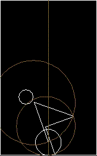
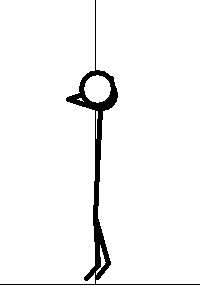

# mastercloud_pfm_halterocms

# Índice
1. [Introducción](#intro)

    1.1 [Objetivos](#goals)

    1.2 [Halterofilia](#intro_haltero)  
2. [Autores](#authors)

## 1. Introducción<a name="intro"/>

El objetivo principal de este proyecto es el desarrollo de una aplicación para la creación y gestión integral de una competición de halterofilia, según la normativa de la Federación Española de Halterofilia (FEH), dirigido mediante el proceso de desarrollo RUP.

### 1.1 Objetivos<a name="goals"/>

El objetivo principal del proyecto es el desarrollo de una aplicación web para la gestión integral de una competición de halterofilia. Para llevar a cabo este proyecto se va a utilizar el proceso unificado de desarrollo  Rational Unified Process (RUP)

Los subojetivos del proyecto son:
* Profundizar en el proceso de desarrollo RUP aplicado a un proyecto real.
* Realizar un proyecto focalizado en:  
    * Afianzar el correcto análisis y diseño
    * Aplicación correcta de diversos patrones
* Aplicación de un modelo de desarrollo basado en *Trunk based development*
* Implementar un entorno de integración y despliegue continuos mediante el uso de:
    * Git como gestor de versiones
    * Github como repositorio (tanto de código como de artefactos)
    * Github Actions como herramienta de integración continua
* Despliegue de una aplicación en la nube mediante el proveedor AWS

### 1.2 ¿Qué es la halterofilia? <a name="intro_haltero"/>
La halterofilia es un deporte que consiste en el levantamiento del máximo peso posible de una barra a cuyos extremos se fijan varios discos de distinto peso.
Existen dos modalidades de competición *arrancada(snatch)* y *dos tiempos(clean&jerk)*

Se divide en categoría masculina y femenina. A su vez, ambas se subdividen en distintas categorías de acuerdo a la masa corporal y edad del atleta.

Más información

[Vídeo 1](https://www.youtube.com/watch?v=-zJeDy-gBr4)

[Vídeo_2](https://www.youtube.com/watch?v=l8oxCtwQdm0)

[Vídeo_3](https://www.youtube.com/watch?v=UcWjOqbZuo0&t=144s)

## Autores <a name="authors"/>

👤 **Natalia Roales**

👤 **Jaime Hernández** 
