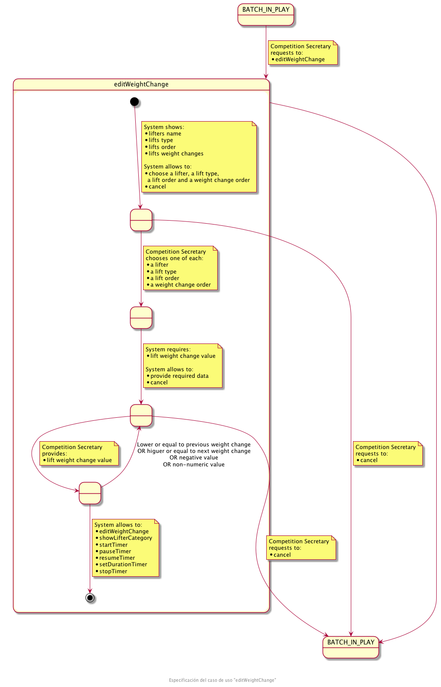
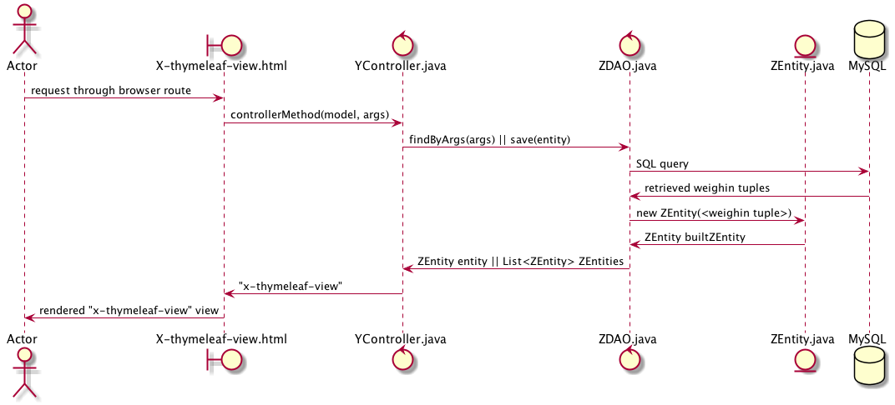

# HalteroCMS - Haltero Championship Management System

# Índice
1. [Introducción](#intro)

    1.1 [Objetivos](#goals)

    1.2 [Halterofilia](#intro_haltero)

2. [Proceso unificado de desarrollo (RUP)](#rup)

3. [Modelo del dominio](#domainModel)

    3.1. [Modelando los estados del dominio](#domainModelStates)

4. [Disciplina de requisitos](#requirements)

    4.1 [Actores y casos de uso](#useCasesActors)
 
    4.2 [Priorizar casos de uso](#useCasesPrioritize)

    4.3 [Especificación de casos de uso](#useCasesSpecification)
    
    4.4 [Prototipado interfaz de usuario](#useCasesPrototype)
 
5. [Disciplina de análisis](#analisis) 

    5.1 [Análisis de la Arquitectura](#architectureAnalisys)

    5.2 [Análisis de Caso de Uso](#usecaseAnalisys)
              
6. [Disciplina de Diseño](#design)

    6.1 [Diseño de la Arquitectura](#architectureDesign)
   
    6.2 [Diseño de Caso de Uso](#useCasesDesign)

    6.3 [Diseño de Clase](#classesDesign)

7. [Disciplina de Implementación](#implementation)
    
    7.1 [Casos de uso implementados](#useCasesImplementation)

    7.2 [Desarrollo Dirigido mediante las Pruebas](#tdd)

8. [Disciplina de Pruebas](#tests)

9. [Bibliografía](#biblio)

## 1. Introducción<a name="intro"/>

El objetivo principal de este proyecto es el desarrollo de una aplicación para la creación y gestión integral de una competición de halterofilia, 
según la normativa de la Federación Española de Halterofilia (FEH), dirigido mediante el proceso de desarrollo RUP.

En los últimos años el deporte de la halterofilia ha crecido exponencialmente, debido a esto, es necesario que la gestión de competiciones se automatice
y se facilite todo lo posible tanto a jueces, espectadores, levantadores, etc el seguimiento de la competición.

### 1.1 Objetivos<a name="goals"/>

El objetivo principal del proyecto es el desarrollo de una aplicación web para la gestión integral de una competición de halterofilia. Para llevar a cabo este proyecto se va a utilizar el proceso unificado de desarrollo  Rational Unified Process (RUP)

Los subojetivos del proyecto son:
* Profundizar en el proceso de desarrollo RUP aplicado a un proyecto real.
* Realizar un proyecto focalizado en:  
    * Afianzar el correcto análisis y diseño
    * Aplicación correcta de diversos patrones
* Aplicación de un modelo de desarrollo basado en *Gitflow*
* Implementar un entorno de integración y despliegue continuos mediante el uso de:
    * Git como gestor de versiones
    * Github como repositorio (tanto de código como de artefactos)
    * Github project como administrador/organizador de tareas
    * Github Actions como herramienta de integración continua

### 1.2 쯈ué es la halterofilia? <a name="intro_haltero"/>
La halterofilia es un deporte que consiste en el levantamiento del máximo peso posible de una barra a cuyos extremos se fijan varios discos de distinto peso.
Existen dos modalidades de competición *arrancada(snatch)* y *dos tiempos(clean&jerk)*

Se divide en categoría masculina y femenina. A su vez, ambas se subdividen en distintas categorías de acuerdo a la masa corporal y edad del atleta.

Más información

[Vídeo 1](https://www.youtube.com/watch?v=-zJeDy-gBr4)

[Vídeo_2](https://www.youtube.com/watch?v=l8oxCtwQdm0)

[Vídeo_3](https://www.youtube.com/watch?v=UcWjOqbZuo0&t=144s)

## 2. Proceso unificado de desarrollo (RUP)

El proceso unificado de desarrollo o RUP (Rational Unified Process)  es un proceso iterativo de desarrollo de software basado en componentes interconectados 
y bien definidos vía sus interfaces. RUP es un marco de trabajo que puede utilizarse en todo tipo de desarrollos.

Las tres principales características de RUP son las siguientes son (1) dirgido por casos de uso, (2) centrado en la arquitectura y (3) proceso iterativo incremental.

(1) Los casos de uso son la piedra angular para establecer el comportamiento deseado del sistema y cómo comunicar este comportamiento entre los diferentes implicados en el sistema. 
Nos sirven para capturar los requisitos funcionales correctamente representados, etc

(2) La arquitectura es usada como artefacto primordial para la conceptualización, construcción, gestión y evolución del sistema en desarrollo

(3) Iterativo implica que el proceso involucra un flujo de entregas ejecutables e incremental ya que con cada nueva entrega se proporciona un incremento respecto a la anterior

Las 5 disciplinas o flujos de trabajo de RUP son Requisitos, Análisis, Diseño, Implementación y Pruebas

y cada una se divide en 4 fases: Inicio, Elaboración, Construcción y Transición. El esfuerzo dedicado a la realización de las actividades de las 
diferentes disciplinas depende del momento del proyecto en el que estemos

## 3. Modelo de dominio <a name="domainModel"/> 
El modelo del dominio describre los conceptos más importantes del contexto del sistema como son:
* Objetos de negocio
* Objetos del mundo real y conceptos que un sistema necesita hacer un seguimiento
* Eventos que suceden o que sucederán en el sistema

El modelo del dominio también es importante, ya que nos ayuda a tener y consensuar un vocabulario común.

Para obtener el modelo del dominio se ha tenido en cuenta las necesidades actuales de la Federación Madrileña de Halterofilia
a la hora de realizar la gestión integral de una competición de halterofilia. Para ello se ha hablado con distintas personas de la federación 
para conocer los requisitos necesarios para cada uno de ellos.

En la Figura 1 se puede observar los objetos del dominio, sus relaciones y el vocabulario consensuado por el cliente.

El modelo de dominio nos puede ayudar también a tener una mejor comprensión de la organización destino. Un ejemplo de esto podría ser una muestra real de como se distribuyen las categorías oficiales en la halterofilia, tal y como se puede ver en la Figura 2.

### 3.1. Modelando los estados del dominio <a name="domainModelStates"/>

Otra forma muy interesante de modelar la realidad es mediante los estados que conforman los procesos involucrados en el dominio. Para ello se han realizado una serie de diagramas de estados, los cuales modelan la realidad correspondiente a los siguientes procesos:
- La competición de principio a fin.
- Cada ronda.
- Cada iteración dentro de una ronda.
- La fase de clasificación.

#### 3.1.1. Estados de una competición

En la siguiente figura se muestra el diagrama de estados para una competición:

#### 3.1.2. Estados de una ronda

En la siguiente figura se muestra el diagrama de estados para una ronda:

#### 3.1.3. Estados de una iteración

En la siguiente figura se muestra el diagrama de estados para una iteración dentro de una ronda:

#### 3.1.4. Estados de la fase de clasificación

En la siguiente figura se muestra el diagrama de estados para la fase de clasificación:

## 4. Disciplina de requisitos <a name="requirements"/>

La disciplina de requisitos es el flujo de trabajo (realización de casos de uso que incluye roles, actividades y artefactos)
cuyo principal propósito es *dirigir el desarrollo hacia el sistema correcto* describiendo los requisitos del sistema
de tal manera que se alcance un contrato entre cliente, usuarios y desarrolladores sobre lo que el sistema debe hacer.

Objetivos:

*   Establecer y mantener el acuerdo entre clientes y otros implicados sobre lo que el sistema debería hacer
*   Proveer a los desarrolladores una mejor comprensión de los requisitos del sistema
*   Definir los límites del sistema
*   Proveer la base para planificar los contenidos técnicos de cada iteración

Las actividades recomendadas por RUP en esta disciplina son las siguientes:

1. Encontrar actores y casos de uso
2. Priorizar casos de uso
3. Especificación casos de uso
4. Estructurar el modelo de casos de uso
5. Prototipado de la interfaz de usuario 

### 4.1 Actores y casos de uso <a name="useCasesActors"/>
* Un actor especifica un rol que adopta una entidad externa cuando interactúa con el sistema **directamente** (no en respuesta)
  Si se necesita modelar cosas que suceden en el sistema en un tiempo específico pero que parece que no lo lanza ningún actor, se puede introducir el **actor tiempo**

* Un caso de uso es una **especificación de secuencias de acciones, incluyendo posibles variaciones, 
que el sistema puede realizar y que dan un resultado observable de interés a un actor particular**

En la Figura 3 podemos ver los actores que se han identificado, mientras que en el resto de figuras se representan los casos de uso identificados y los actores que los realizan

            

### 4.2 Priorizar casos de uso <a name="useCasesPrioritize"/>
Hay que **determinar qué casos de uso seran desarrollados** (analizados, diseñados, implementados y probados) en
las primeras iteraciones y cuáles se pueden desarrollar en sucesivas iteraciones teniendo en cuenta factores como puedan ser aspectos técnicos, aspectos económicos, aspectos de negocio o cualquier tipo de riesgo

En nuestro caso hemos decidido que los casos de uso que nos interesaba terminar lo antes posible debido a factores de negocio y al tener una mayor complejidad en su lógica son los relacionados con "jugar la tanda". 
A partir de ese primer hito, en sucesivas iteraciones se van a ir completando toda la gestión de tandas, competiciones, etc tal y como se muestran en la siguiente figura

### 4.3 Especificación de casos de uso <a name="useCasesSpecification"/>

Durante esta actividad, nos hemos centrado en los casos de uso correspondientes al secretario de la competición y al secretario de la organización. Mediante la especificación de los casos de uso seleccionados, definiremos de manera minuciosa cada uno de los estados por los que pasa el caso de uso a especificar, y añadiremos los detalles sobre todas las transiciones de un estado a otro.

A nivel funcional, en lo que a un caso de uso se refiere, no nos dejaremos ningún detalle fuera del diagrama de su especificación, y seremos capaces de saber cómo se comporta el sistema esté en el punto en el que esté.

#### 4.3.1. Especificación de casos de uso del secretario de la competición

- Introducir datos de un pesaje:

- Iniciar una ronda:

- Añadir o actualizar el peso de un levantamiento:

- Añadir o actualizar el estado de un levantamiento:

- Añadir o actualizar un cambio de peso:

#### 4.3.2. Especificación de casos de uso del secretario de la organización

- Mostrar categorías:

- Eliminar una categoría:

- Añadir o actualizar una categoría:

- Mostrar clubs:

- Eliminar un club:

- Añadir o actualizar un club:

- Mostrar organizadores:

- Eliminar un organizador:

- Añadir o actualizar un organizador:

- Mostrar inscriptores:

- Eliminar un inscriptor:

- Añadir o actualizar un inscriptor:

### 4.4 Prototipado interfaz de usuario   <a name="useCasesPrototype"/>

A continuación se detallan los prototipos de las interfaces del usuario que permiten el intercambio de información detallado en los diagramas de especificación
de casos de uso. 

Para cada uno de los actores del sistema se ha generado un web map donde se puede ver como se interconectan las distintas pantallas de prototipo y los casos de uso que se cubren.
 
* Actor _spectator_

* Actor _organization secretary_

* Actor _inscriber_

* Actor _organizer_

* Actor _competition secretary_

## 5. Disciplina de análisis <a name="analisis"/>

La finalidad de la disciplina de análisis es el flujo de trabajo (realización de casos de uso que incluyen trabajadores, actividades y diagramas)
cuyo propósito principal es analizar los requisitos de la captura de requisitos a través de su refinamiento y la estructura para lograr una comprensión más precisa de los
requisitos, una descripción de los requisitos que es fácil de mantener y nos ayudan a estructurar el sistema.

Las actividades que RUP recomienda para esta disciplina son las siguientes:
- Análisis de la arquitectura.
- Análisis de casos de uso.
- Análisis de clases.
- Análisis de paquetes.

Nosotros, en este proyecto, hemos trabajado en las actividades de análisis de arquitectura y de análisis de casos de uso.

### 5.1 Análisis de la arquitectura <a name="architectureAnalisys">

<<<<<<< TODO - Jaime >>>>>>>

### 5.2 Análisis de casos de uso <a name="usecaseAnalisys">

Tras realizar la actividad anterior, análisis de la arquitectura, podemos comenzar el análisis de los casos de uso. En esta actividad trataremos de recoger qué componentes de los que hemos obtenido en el análisis de la arquitectura están involucrados en cada caso de uso, y de qué forma se relacionan y a través de qué mensajes.

De ahora en adelante centraremos toda nuestra atención en dos casos de uso distintos: 'introduceWeighinData' y 'editLift', o lo que es lo mismo, añadir un nuevo pesaje y editar un levantamiento. Las figuras que se incluyen a continuación, muestran el análisis de estos dos casos de uso.

- Análisis del caso de uso 'introduceWeighinData':

- Análisis del caso de uso 'editLift':

 
## 6. Disciplina de diseño <a name="design"/>

El principal propósito de la disciplina de diseño es desarrollar modelos enfocados sobre los requisitos no funcionales y el dominio de la solución, y prepararnos para la implementación y las pruebas del sistema.

En esta fase, identificaremos los distintos subsistemas pero también dejaremos claro cómo se conectan entre sí, es decir, definiremos las posibles interfaces entre los mismos. Desgranaremos a su vez todo el trabajo de implementación en unidades más pequeñas, para que pueda ser asumida cada una por distintos equipos de trabajo. Y además profundizaremos en los requisitos no funcionales, detectando toda limitación que pueda existir en las tecnologías de las cuáles vayamos a hacer uso. 

Las **actividades** recomendadas por RUP para esta disciplina son las siguientes:
1. Diseñar la arquitectura.
2. Diseñar casos de uso.
3. Diseñar clases.
4. Diseñar subsistemas.

En este proyecto hemos trabajado en las tres primeras actividades, habiendo sido generados una serie de diagramas que vamos a explicar a continuación.

### 6.1. Diseñar la arquitectura <a name="architectureDesign"/>

En el diseño de la arquitectura, se han identificado los nodos y conexiones reflejados en la siguiente figura.

En primer lugar, vemos que existe un **webServer** que se compone del cliente web (**halteroCmsClient**) y de los servicios del backend (**halteroCmsService.war**). Debido a nuestra escasa experiencia desarrollando con tecnologías front, hemos decidido utilizar un motor de plantillas (Thymeleaf en este caso), y por eso el servidor **Tomcat** usa ambos.

El cliente renderiza las plantillas y genera una serie de páginas html, las cuáles son consumidas por el navegador web. Y por otro lado, el servidor se conecta con una base de datos MySQL.

Por último, vemos que el cliente hace uso del paquete del código correspondiente a las vistas, y que el war de los servicios hace uso de los controladores, modelos y DAOs.

### 6.2. Diseñar casos de uso <a name="useCasesDesign"/>

Para el desempeño de esta actividad, hemos seleccionado la herramienta de los diagramas de secuencia, especificando en ellos componentes concretos (vistas html, clases java, etc.) y los mensajes que éstos intercambiarán.

Únicamente hemos diseñado dos casos de uso, pero si nos pusiésemos a diseñar más, los diagramas de secuencia serían bastante similares entre ellos. Por este motivo, incluímos a continuación un diagrama de secuencia genérico que podría aplicarse a cualquier diseño de caso de uso.

#### 6.2.1. Diseño del caso de uso 'introduceWeighinData'

En la siguiente figura se muestra el diagrama de secuencia para el caso de uso 'introduceWeighinData', correspondiente a la operación de introducir los datos de un pesaje (que son el peso corporal del levantador y los openers).

El detonante de este caso de uso es el Secretario de la Competición, quien interactuará con la vista show-competition-play a través del navegador. Pero debemos hacer un apunte en este diagrama, y es que a la hora de implementar este caso de uso, gracias al framework de desarrollo, todo lo que haya a la derecha del componente WeighinsDAO será transparente al programador. El programador se encargará de definir una interfaz en WeighinsDAO.java y el framework hará el resto del trabajo (componer la query, consultar la query a MySQL, llamar al constructor de Weighin, etc.).

#### 6.2.2. Diseño del caso de uso 'showBatchInPlay'

<<<<<<<< TODO - JAIME: This one needs to be corrected >>>>>>>>

El detonante de este caso de uso es el Secretario de Competición, que a través de la vista correspondiente solicita obtener los levantadores y levantamientos correspondientes a la tanda en juego. 
### 6.3. Diseñar clases <a name="classesDesign"/>

Inspirándonos principalmente en el modelo del dominio, y basándonos en todo el trabajo realizado en posteriores disciplinas, hemos diseñado las clases que formarán parte de nuestro desarrollo. Quedan recogidas en el siguiente diagrama de clases.

Al contrario que en el modelo del dominio, esta división en clases ya está preparada para ser llevada directamente al código java, y cada una de ellas ya dispone de atributos tipados e incluso algunos métodos.

## 7. Disciplina de implementación <a name="implementation"/>

La disciplina de implementación, es el flujo de trabajo cuyo propósito principal es implementar el sistema en términos de componentes, como pueden ser el código, los fichero binarios, ejecutables, vistas renderizadas, etc.

El **objetivo** que se debe conseguir con esta disciplina es la generación del código necesario para la implementación de las clases y objetos en términos de componentes, definiéndose de forma previa su organización en términos de subsistemas divididos en capas, y cubriéndose esta implementación con las necesarias pruebas unitarias.

Las **actividades** recomendadas por RUP para esta disciplina son las siguientes:
1. Implementación de la arquitectura.
2. Integración de los sistemas.
3. Implementación de un subsistema.
4. Implementación de una clase.
5. Realización de las pruebas de unidad.

### 7.1. Casos de uso implementados <a name="useCasesImplementation"/>

<<<<< WIP >>>>>

### 7.2. Desarrollo Dirigido mediante las Pruebas <a name="tdd"/>

Para nosotros los tests son imprescindibles en cualquier tipo de proyecto software. Por tanto, durante la ejecución de la Disciplina de Implementación, hemos aplicado TDD. El desarrollo dirigido mediante las pruebas, o lo que es lo mismo "Test Driven Development", consiste en implementar las pruebas de forma previa a la funcionalidad. Esta filosofía de desarrollo funciona bajo la premisa de que los tests son parte de la aplicación, no un añadido del que se pueda prescindir. Sin los tests, el código no está completo.

La razón de más peso por la cuál hemos decidido hacer TDD, es que es una muy buena práctica para no desarrollar "código de más". De esta forma, aprovechando nuestra experiencia a la hora de hacer tests, se ha invertido mucho menos tiempo en implementar los casos de uso desarrollados que si hubiésemos programado el código funcional al principio del todo.

Además, teniendo descrita la especificación de los casos de uso en la Disciplina de Requisitos, ha sido muy fácil enumerar los distintos tests que la plataforma debe pasar para dar por concludo el desarrollo. En este punto queremos indicar que los únicos tests que se han llevado a cabo son los test unitarios, que son los indicados por RUP en esta Disciplina.

Siguiendo TDD se podría dirigir el desarrollo mediante tests _end to end_, aunque entre todos los posibles tipos de tests que se pueden añadir, los test unitarios son los que más útiles nos resultan para completar la implementación de nuestros casos de uso.

## 8. Disciplina de pruebas <a name="tests"/>

La disciplina de pruebas, es el flujo de trabajo cuyo principal propósito es comprobar el resultado de la implementación probando cada construcción, incluyendo construcciones de versiones intermedias y final que se entregará.

Los **objetivos** que esta disciplina persigue, consisten en la validación de la implementación llevada a cabo acerca del producto software, ya sea desde el lado funcional (es decir, que los requisitos se cumplen al 100%) como desde parte no funcional (la calidad que el sistema ofrece). Además, mediante las pruebas trataremos de localizar errores en nuestro desarrollo, documentándolos para poder solventarlos posteriormente.

Las **actividades** recomendadas por RUP para esta disciplina son las siguientes:

1. Planificación de las pruebas de software.
2. Diseño de dichas pruebas.
3. Implementación de las mismas.
4. Realización de pruebas de integración.
5. Realización de pruebas de sistema.
6. Evaluación de las pruebas realizadas.

Durante la ejecución de este proyecto no se ha podido llevar a cabo la Disciplina de Pruebas de forma seria y procedimentada, pues necesitaríamos muchísimo más tiempo y experiencia para aplicar todas las disciplinas al completo.

Aun así, hemos realizado algunas pruebas funcionales de forma manual, siguiendo los distintos caminos marcados en los diagramas de la especificación de los casos de uso que hemos implementado. Consideramos que el conjunto de estas pruebas sumadas a los test unitarios desarrollados en la Disciplina anterior, proporcionan una red de seguridad mínima con la que al menos nos sentimos cómodos al entregar este Proyecto.

## Conclusiones <a name="conclusions"/>
## Autores <a name="authors"/>

👤 **Natalia Roales**

👤 **Jaime Hernández** 

## Bibliografía <a name="biblio"/>

[1] Kanban proyecto [webpage online]. Available: https://github.com/zuldare/mastercloud_pfm_halterocms/projects/1

[1] Github actions [webpage online]. Available: https://github.com/features/actions

[1] PlantUml [webpage online]. Available: [https://plantuml.com/es/](https://plantuml.com/es/)

[1] Pencil [herramienta]. Available: [https://pencil.evolus.vn/](https://pencil.evolus.vn/)

